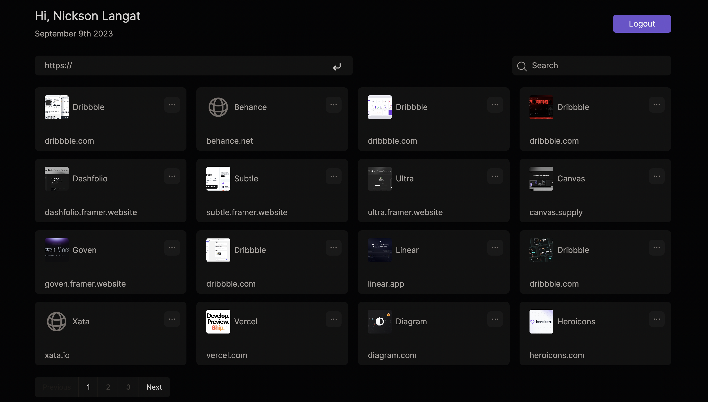

# Neptune Project Description

Neptune is a bookmarking application with a minimalistic yet elegant touch. Everything happens within one 
single page and everything is neatly arranged in an intuitive, responsive and interactive manner. 

Let’s take a tour of the system from start to finish.

The first step is a new user goes to the registration page and they are presented with the registration form to fill and submit.

Next up they are navigated to the login page where, once they supply valid credentials, 
they are authenticated and taken to the main dashboard/home page where they have access to the following screen:

  

A lot is happening on here so let’s break it down:

At the top they get a greeting with their full name added. On the right they have a button to log them out of the system.

Next we have two input fields. On the left users can use this field to add new links to the system by simply 
typing or pasting into the input and pressing the enter key on their keyboard. On the right users can use this field to search for a particular bookmark.

Next up we have a grid of cards that are the bookmarks in the database. Each bookmark has an ellipsis button that opens up a few options.
The options include editing, copying, duplicating and deleting a bookmark.

At the bottom we have pagination to load new bookmarks from the database.

And that is a wrap for this project.
